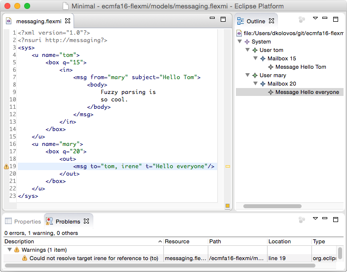

Flexmi
======
Flexmi is an implementation of EMF's Resource interface that can parse XML documents in a fuzzy manner. For example it can parse the following XML document (messaging.flexmi):
```xml
<?xml version="1.0"?>
<?nsuri http://messaging?>
<sys>
	<u name="tom">
		<box q="15">
			<out>
				<msg from="mary" subject="Hello Tom">
					<body> 
						Fuzzy parsing is
						so cool.
					</body>
				</msg>
			</out>
		</box>
	</u>
	<u name="mary">
		<box q="20">
			<out>
				<msg to="tom, irene" t="Hello everyone"/>
			</out>
		</box>
	</u>
</sys>
```
as a valid instance of the Ecore metamodel (in Emfatic) below:
```java
@namespace(uri="http://messaging", prefix="")
package messaging;

class System {
	val User[*] users;
}

class User {
	id attr String name;
	val Mailbox mailbox;
}

class Mailbox {
	attr int quota;
	val Message[*] incoming;
	val Message[*] outgoing;
}

class Message {
	attr String subject;
	attr String body;
	ref User from;
	ref User[*] to;
}
```	
Use
---
Flexmi can be used like any other EMF resource implementation. An example follows.

```java
ResourceSet resourceSet = new ResourceSetImpl();
resourceSet.getResourceFactoryRegistry().getExtensionToFactoryMap().put("flexmi", 
	new FlexmiResourceFactory());
Resource resource = resourceSet.createResource(URI.createFileURI("/../messaging.flexmi"));
resource.load(null);
```
Editor
---
An Eclipse editor for `.flexmi` files is also available in the `org.eclipse.epsilon.flexmi.dt` project.



Limitations
---
Flexmi resources can't be saved programmatically (i.e. trying to call `resource.save(...)` will throw an `UnsupportedOperationException`).